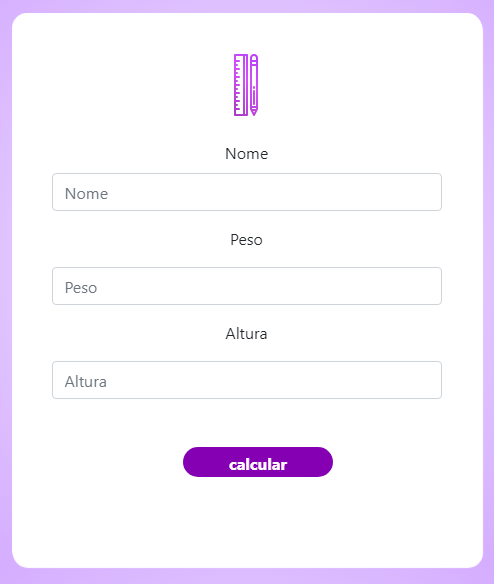

# Imc

Neste projeto, a partir do nome, da peso e da altura do usuário, calcula-se o IMC e avalia-se em qual faixa de peso ele se encontra. A solução pode ser utilizada por médicos, nutricionistas e educadores físicos, por exemplo.

